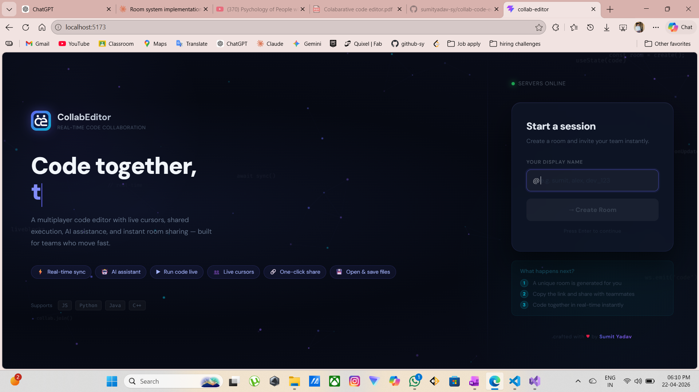
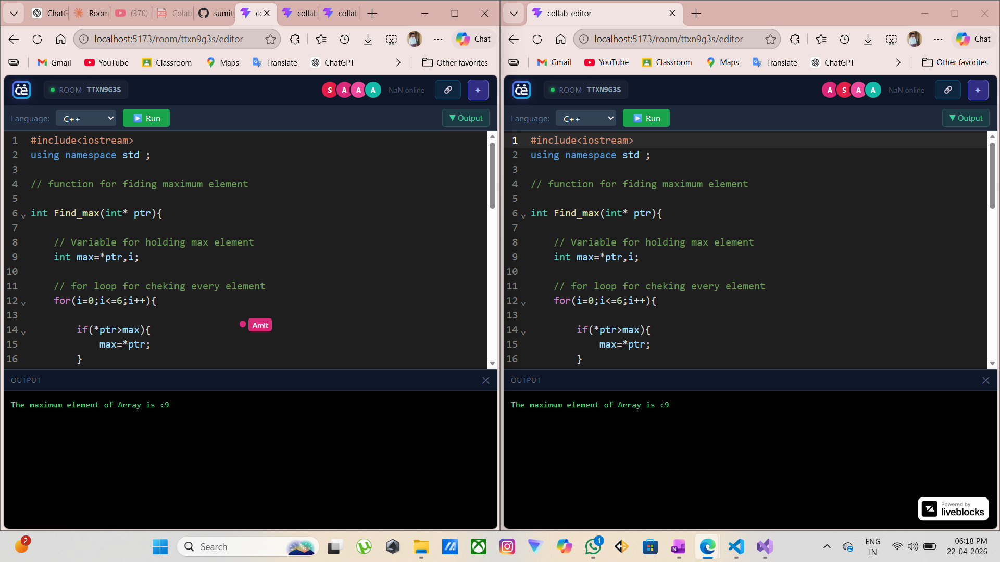
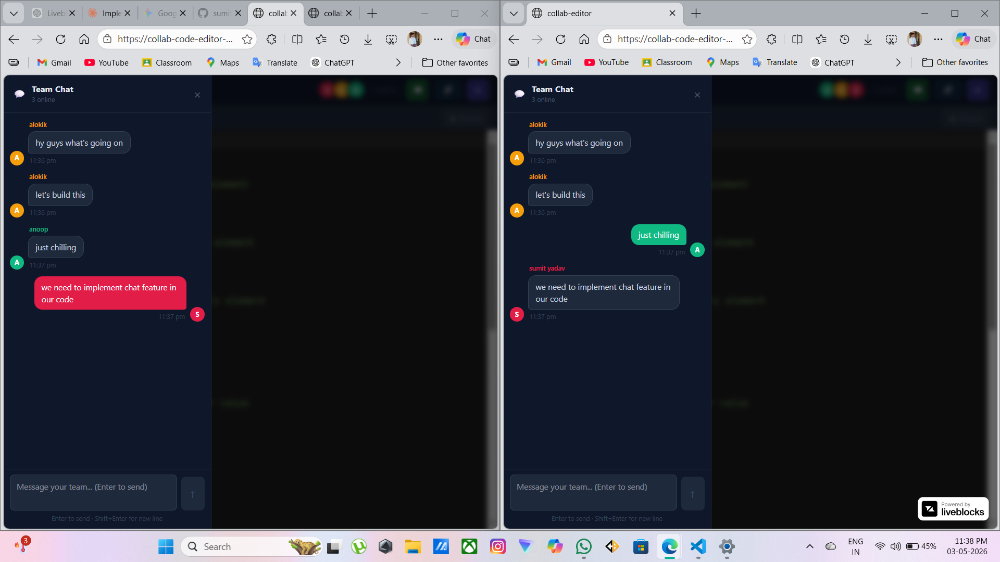
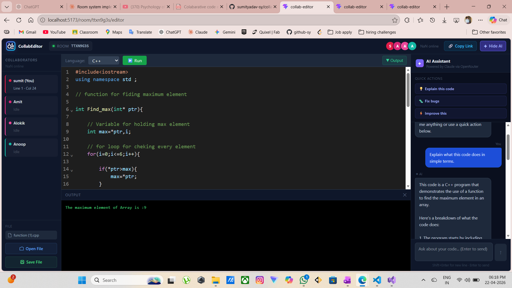
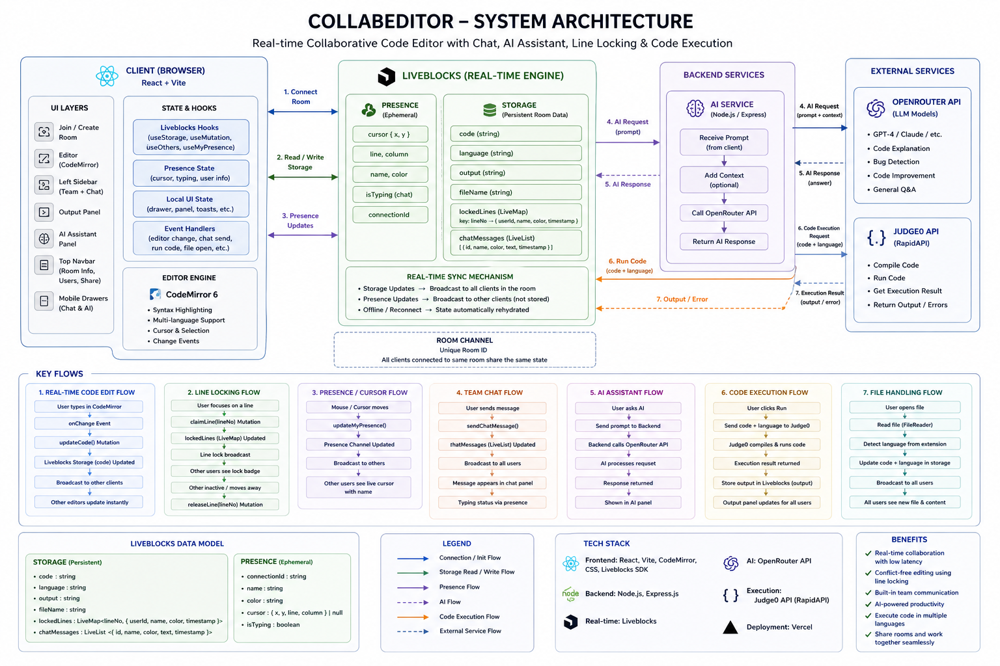
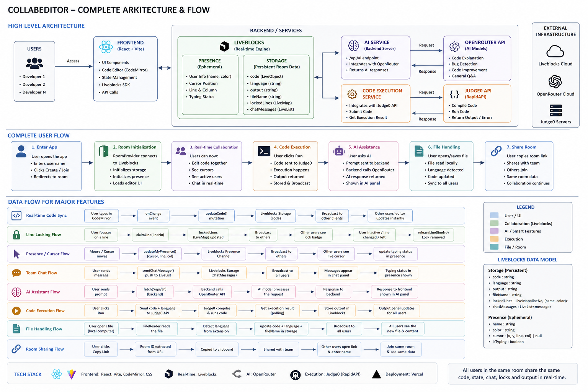

# CollabEditor
> 🌐 Try the app live here:  
> 👉 https://collab-code-editor-one.vercel.app/

---

A real-time multiplayer code editor built for teams. Multiple users can write, run, and debug code together in a shared room with live cursors,team chat, AI assistance, and instant room sharing — all in the browser.
---

## Badges


-black?style=flat)


---

## Features

### Real-time Collaboration
- Live multi-user editing(Multiple users edit the same file simultaneously)
- Live cursor tracking with usernames
- Presence tracking (line, column)
- Avatar stack for active users

### Advanced Editing Features
- Line-level locking system
- Automatic lock release
- Lock ownership validation
- Locked line indicator banner
- Shared language synchronization

### Room System
- Unique room ID generation
- Shareable join links
- Username-based identity
- Safe routing (no username → redirect)

### Code Editor
- CodeMirror integration
- Syntax highlighting
- Supports:
  - JavaScript
  - Python
  - Java
  - C++

### Code Execution
Code Execution Features
- Run code directly in editor

Integrated with RapidAPI Judge0 API

- Multi-language execution support

Runs:

JavaScript
Python
Java
C++
- Shared output panel
Execution output visible to all users
- Output panel toggl
- Error handling for execution
Handles compile/runtime/API errors

### AI Assistant
- Claude (via OpenRouter)
- Explain code
- Fix bugs
- Improve code
- Custom AI prompts

### File Management 
- Open local files

Supports:

.js
.py
.java
.cpp
- Auto-detect language from file extension
- Save/download code to local file
- Shared filename synchronization

### Team Chat Features
- Real-time team chat
- Message timestamps
- Sender-based message styling
- Typing indicators
- Unread message badge
- Mobile chat drawer
- Auto-scroll to latest messages
- Chat history persistence

### UI / UX
- Animated landing page for create and join room
- Persistent user color identity
- Toast notifications
- Online user count
- Responsive mobile layout
- Team/collab sidebar tabs

---

## Screenshots

### Landing Page / Create Room


### Editor - Collaboration View


### team chat 


### AI Assistant Panel


---

## Project Structure

```
collab-editor
├── collab-editor-backend
│ ├── node_modules
│ ├── .env
│ ├── package.json
│ └── server.js
│
├── public
│ ├── coollab_logo.png
│
├── src
│ ├── components
│ │ └── Editor.jsx
│ │
│ ├── pages
│ │ └── JoinRoom.jsx
│ │
│ ├── utils
│ │ └── presence.js
│ │
│ ├── App.jsx
│ ├── main.jsx
│ ├── liveblocks.config.js
│ ├── App.css
│ └── index.css
│
├── index.html
├── package.json
└── README.md
```

---

## Tech Stack

### Architechture


### Frontend
- React
- React Router
- CodeMirror
- Liveblocks

### Backend
- Node.js
- Express

### APIs
- Liveblocks (real-time sync)
- Judge0 (code execution)
- OpenRouter (AI)

---

## Application Flow

### Application Flow 



### Room Flow
1. User enters username  
2. Room is created or joined  
3. Username stored in sessionStorage  
4. Redirect to editor  

### Collaboration Flow
1. Connect to Liveblocks room  
2. Presence initialized (name, color, cursor)  
3. Code syncs across users  
4. Cursor positions update in real-time  

### Code Execution Flow
1. User clicks Run  
2. Code sent to Judge0 API  
3. Token received  
4. Polling for result  
5. Output displayed  

### AI Flow
1. User sends prompt  
2. Backend `/api/ai` called  
3. OpenRouter processes request  
4. Response returned to UI  

---

## Installation

### Clone Repository
```bash
git clone https://github.com/your-username/collab-editor.git
cd collab-editor

---

## Environment Variables

### Frontend (`collab-editor/.env`)

```
VITE_RAPIDAPI_KEY=your_rapidapi_key_here
VITE_RAPIDAPI_HOST=judge029.p.rapidapi.com
```

### Backend (`collab-editor-backend/.env`)

```
OPENROUTER_API_KEY=your_openrouter_api_key_here
```

---

## Getting Started

### Prerequisites

- Node.js v18 or higher
- A Liveblocks account with a public API key
- A RapidAPI account subscribed to the Judge0 CE API
- An OpenRouter account with an API key

### Installation

**1. Clone the repository**

```bash
git clone https://github.com/your-username/collab-editor.git
cd collab-editor
```

**2. Install frontend dependencies**

```bash
npm install
```

**3. Install backend dependencies**

```bash
cd collab-editor-backend
npm install
```

**4. Configure environment variables**

Create `.env` in the root frontend directory:

```bash
VITE_RAPIDAPI_KEY=your_key_here
VITE_RAPIDAPI_HOST=judge029.p.rapidapi.com
```

Create `.env` inside `collab-editor-backend/`:

```bash
OPENROUTER_API_KEY=your_key_here
```

**5. Add your Liveblocks public key**

Open `src/liveblocks.config.js` and replace the `publicApiKey` value with your own key from the Liveblocks dashboard.

**6. Run the backend**

```bash
cd collab-editor-backend
node server.js
# Server running on http://localhost:3001
```

**7. Run the frontend**

Open a new terminal in the root directory:

```bash
npm run dev
# Local: http://localhost:5173
```

**8. Open the app**

Navigate to `http://localhost:5173` in your browser. Create a room, share the link with a teammate, and start coding together.

---

## API Reference

### Backend — POST /api/ai

Proxies a prompt and code context to Claude 3 Haiku via OpenRouter.

## Author

**Sumit Yadav**

---

## License

This project is licensed under the MIT License - see the LICENSE file for details.

MIT License © 2026 [Sumit Yadav]

This project is licensed under the [MIT License](./LICENSE).